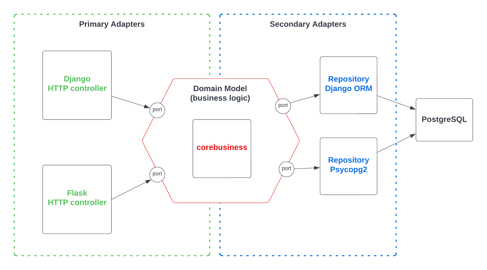

# Hexagonal Architecture Example in Python

Welcome! Inside this repository you can find a project using 3 different HTTP frameworks and a single business logic module. The folder structure is:

- `corebusiness`: contains the business logic layer and the definition of the ports
- `adapters/`: contains the implementation of the ports
    - `primary/`: contains the implementation of the primary adapters (HTTP controllers, CLI, etc)
        - `django`: contains an implementation of the HTTP controller using Django.
        - `flask`: contains an implementation of the HTTP controller using Flask.
        - `fastapi`: contains an implementation of the HTTP controller using FastAPI.
    - `secondary/`: contains the implementation of the secondary adapters (data providers, services, etc)
        - `django_orm`: contains the implementation of the repositories using Django ORM
        - `psycopy`: contains the implementation of the repositories using Psycopg
- `HIGHLYCOUPLED`: contains an example of a project highly coupled with Django framework - things we want to avoid

In this example, we have 3 different adapters to handle HTTP requests that use the same use case `SubmitLoanApplicationUseCase`. The business logic is the same for both, but the way the HTTP requests are handled and the database access is implemented differs.

One can add more ways to access the business logic, it could be a Command Line Interface (CLI) for example. It is also possible to add other implementation of the repositories using different libraries.

## Running

To run this project you need Docker. Build the images using `docker-compose build` and then run `docker-compose up` to run all services.

After that, you should have 3 HTTP servers running, Django at port 8000, Flask at port 5000 and FastAPI at port 9000.

## Testing

This example only contains a single endpoint implemented. The endpoint is responsible to submit an application.

To test it, you should submit a POST request with the form-data parameters: `customer_ssn` and `customer_name` to:

- Django: `http://localhost:8000/app/application`
- Flask: `http://localhost:5000/application`

For FastAPI, you need to submit a JSON payload with the same parameters to:

- FastAPI: `http://localhost:9000/application`

### Unit tests

To run unit tests use this command: `docker-compose run tests`

## References

- https://medium.com/sciforce/another-story-about-microservices-hexagonal-architecture-23db93fa52a2
- https://medium.com/codex/clean-architecture-for-dummies-df6561d42c94
- https://github.com/Sairyss/domain-driven-hexagon
